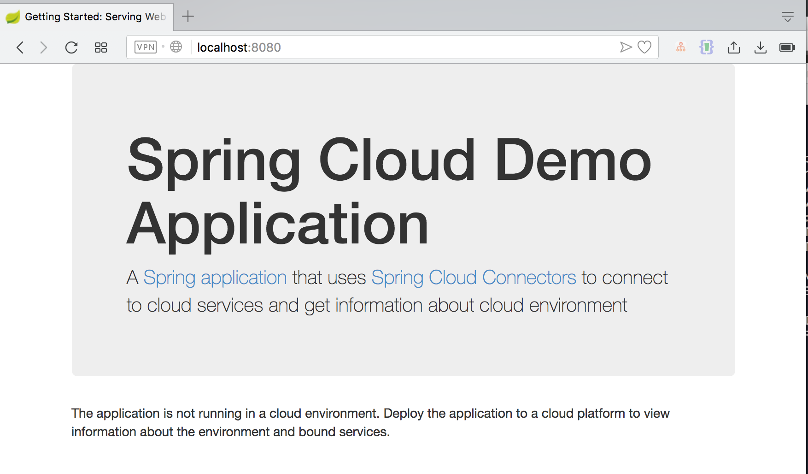

Hello Spring Cloud Connectors
============

A [Spring Boot application](http://github.com/cloudfoundry-samples/hello-spring-cloud) that uses [Spring Cloud Connectors](https://cloud.spring.io/spring-cloud-connectors/) to connect to cloud services and get information about cloud environment.

## Building the application

Use Maven to build the application:

~~~
$ mvn clean package
~~~

## Running the application on Cloud Foundry

To run the application on Cloud Foundry, first target and long into a Cloud Foundry environment, then run this command:

~~~
$ cf push
~~~

The application will be deployed using settings in the provided `manifest.yml` file. The output from the command will show the URL that has been assigned to the application. Browse to the provided URL to view information about the application.

### Creating and binding services

Using the provided manifest, the application will not be bound to any data services. The application UI will show default connections provided by Spring Boot. You can create relational database, Redis, MongoDB, and AMQP services and bind them to the application to test creation of service connections with Spring Cloud Connectors.

On [Pivotal Web Services](https://run.pivotal.io/) you can create and bind each type of service using these commands:

~~~
$ cf create-service cleardb spark mysql-service
$ cf bind-service hello-spring-cloud mysql-service

$ cf create-service rediscloud 30mb redis-service
$ cf bind-service hello-spring-cloud redis-service

$ cf create-service mlab sandbox mongodb-service
$ cf bind-service hello-spring-cloud mongodb-service

$ cf create-service cloudamqp spark amqp-service
$ cf bind-service hello-spring-cloud amqp-service

$ cf restart
~~~

On [Pivotal Cloud Foundry](https://pivotal.io/platform) you can create and bind each type of service using these commands:

~~~
$ cf create-service p-mysql 100mb mysql-service
$ cf bind-service hello-spring-cloud mysql-service

$ cf create-service p-redis shared-vm redis-service
$ cf bind-service hello-spring-cloud redis-service

$ cf create-service p-rabbitmq standard amqp-service
$ cf bind-service hello-spring-cloud amqp-service

$ cf restart
~~~

Consult the [Pivotal Cloud Foundry documentation](http://docs.pivotal.io/) for more details.

Home Page

